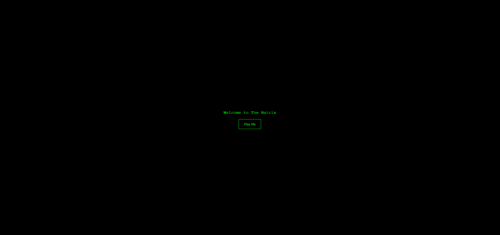
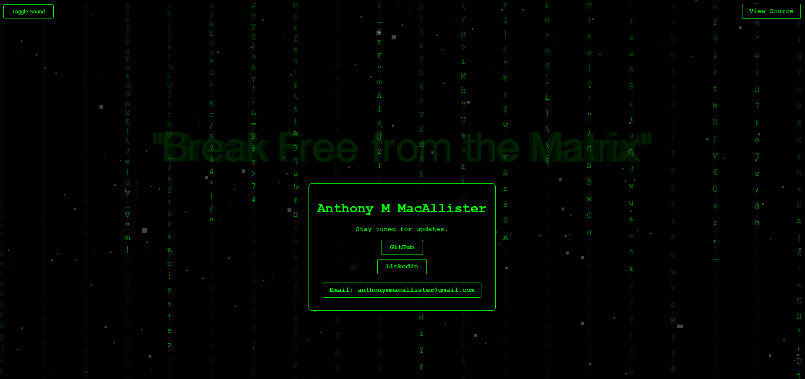

# NeoLandingPage

Welcome to **NeoLandingPage**, an interactive, Matrix-themed landing page that offers a captivating digital experience. This project is more than just a Matrix-inspired visual showcase—it's the launchpad for **MetaBreak (MTBR)**, the Solana-based meme token symbolizing breaking free from the matrix and unlocking limitless potential.




---

## Why MetaBreak (MTBR)?
**MetaBreak (MTBR)** is more than a meme token; it's a movement. Built on Solana's lightning-fast and low-cost blockchain, MTBR offers a unique mix of **collectibility**, **community tipping**, and **gaming integration**. Whether you're a collector, a community contributor, or a gamer, MTBR provides a fun, meaningful way to engage with the decentralized future.

### **Key Utilities of MetaBreak**
1. **Collectible Token**: Own a piece of the Matrix-inspired MetaBreak revolution. Each MTBR represents the idea of freedom and limitless potential.
2. **Tipping and Community Engagement**: Show appreciation to content creators or community members with tips powered by MTBR.
3. **Gaming Integration**: Unlock in-game perks, participate in events, or stake MTBR for rewards in upcoming games and metaverse projects.

---

## Features

- **Matrix Digital Rain**: Immerse yourself in the legendary Matrix digital rain, brought to life with dynamic and interactive animations.
- **MetaBreak Token Support**: Seamlessly connect your Solana wallet to explore and interact with MetaBreak (MTBR). Features include balance display, transaction capabilities, and staking options.
- **Interactive Matrix-Themed Text**: Inspiring, Matrix-inspired quotes that rotate dynamically for an engaging experience.
- **Stylized UI Elements**: Matrix-inspired buttons and interactive elements designed to captivate users.
- **Gaming-Ready Features**: MetaBreak token interaction paves the way for potential gaming integrations.
- **Mobile Optimization**: Fully responsive design ensures an immersive experience on any device.
- **Enhanced Audio**: Activate optional Matrix-inspired ambient music to enhance the immersive experience.

---

## How to Get Started

Follow these steps to experience **NeoLandingPage** and interact with MetaBreak (MTBR):

1. **Clone the Repository**

    ```sh
    git clone https://github.com/ezenity/NeoLandingPage.git
    ```

2. **Navigate to the Directory**

    ```sh
    cd NeoLandingPage
    ```

3. **Install Dependencies**

    Ensure you have Node.js installed, then run:
    ```sh
    npm install
    ```

4. **Run the Project Locally**

    Start a local development server:
    ```sh
    npm start
    ```

5. **Open the Application**

    Visit `http://localhost:3000` in your browser to see NeoLandingPage live. Connect your Solana wallet to explore and interact with MTBR.

---

## Customization

Make NeoLandingPage your own with these simple tweaks:

- **MetaBreak Token Integration**: Modify Solana wallet settings and transaction logic in `MTBRIntegration.js`.
- **Text and Animations**: Update the Matrix-inspired text and animation behaviors in `index.html` and `main.js`.
- **Colors and Layout**: Personalize the design elements in `style.css` to match your preferences.
- **Audio Settings**: Customize the background music in `BackgroundMusic.js`.

---

## Technologies

- **HTML/CSS/JavaScript**: Core technologies for structure, style, and interactivity.
- **Solana Wallet Adapter**: For seamless integration of Solana-based tokens like MetaBreak.
- **Three.js**: Powering the mesmerizing 3D digital rain animations.
- **Tween.js**: Ensuring smooth animations and transitions.

---

## Purpose of MetaBreak (MTBR)

- **Collectibility**: MTBR tokens symbolize freedom and the breaking of societal constraints. Own a collectible piece of this iconic movement.
- **Tipping Economy**: Support creators and community members by tipping them MTBR in a fun and meaningful way.
- **Gaming Ecosystem**: Dive into the gaming metaverse with MTBR-powered rewards, events, and staking opportunities.

---

## Contributing

Your ideas and contributions are welcome! Here's how you can contribute:

1. Fork the Project
2. Create Your Feature Branch (`git checkout -b feature/YourAmazingFeature`)
3. Commit Your Changes (`git commit -m 'Add YourAmazingFeature'`)
4. Push to the Branch (`git push origin feature/YourAmazingFeature`)
5. Open a Pull Request

---

## License

This project is licensed under the **GPL-3.0 License**. See the `LICENSE` file for more details.

---

## Contact

- **Website**: [https://ezenity.com](https://ezenity.com)
- **GitHub**: [NeoLandingPage Repository](https://github.com/ezenity/NeoLandingPage)
- **Instagram**: [_ezenity](https://www.instagram.com/_ezenity/)

---

❤️ Thank you for exploring NeoLandingPage and supporting MetaBreak (MTBR)!
