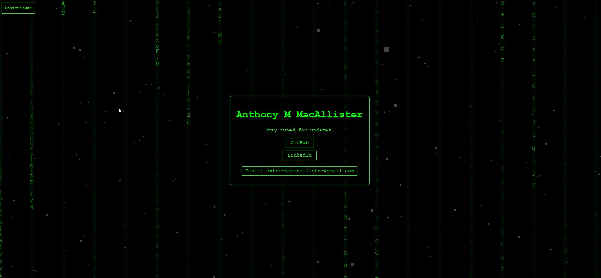

# NeoLandingPage

Welcome to **NeoLandingPage**, a Matrix-themed 'Coming Soon' landing page that immerses visitors in a digital rain environment reminiscent of the iconic scenes from the Matrix movies. This page is designed to captivate and intrigue, setting the stage for your upcoming project, website, or event.



## Features

- **Digital Rain Effect**: Experience the mesmerizing Matrix digital rain that dynamically interacts with user movements.
- **Interactive Particles**: Engage with particles that respond to your cursor, creating an immersive user experience.
- **Futuristic Design**: A sleek and modern design that encapsulates the essence of the Matrix world.
- **Responsive Layout**: Looks great on both desktop and mobile devices.
- **Audio Experience**: Ambient Matrix-themed background music that sets the mood (with user consent).
- **Matrix Styled Buttons**: Interactive buttons styled to match the Matrix theme.
- **Animated Loading Spinner**: A custom Matrix-themed loading spinner for initial page load.

## Setup

1. **Clone the repository**

    ```sh
    git clone https://github.com/yourusername/NeoLandingPage.git
    ```

2. **Navigate to the directory**

    ```sh
    cd NeoLandingPage
    ```

3. **Open `index.html` in your browser**

    That's it! You should now see your NeoLandingPage running locally.

## Customization

- **Modify Text**: Easily change the text to fit your needs by editing the `index.html`.
- **Adjust Colors and Fonts**: Customize the look and feel by modifying the `style.css`.
- **Change Music**: Replace the Matrix-themed music with your choice by changing the file path in `BackgroundMusic.js`.

## Technologies Used

- **HTML**: For structuring the content.
- **CSS**: For styling the content.
- **JavaScript**: For interactive effects and web functionalities.
- **Three.js**: For 3D effects and animations.
- **Tween.js**: For smooth animations.

## Contributing

Contributions are what make the open-source community such an amazing place to learn, inspire, and create. Any contributions you make are **greatly appreciated**.

1. Fork the Project
2. Create your Feature Branch (`git checkout -b feature/AmazingFeature`)
3. Commit your Changes (`git commit -m 'Add some AmazingFeature'`)
4. Push to the Branch (`git push origin feature/AmazingFeature`)
5. Open a Pull Request

## License

Distributed under the MIT License. See `LICENSE` for more information.

## Contact

IG: [@_ezenity](https://www.instagram.com/_ezenity/)

Project Link: [https://github.com/ezenity/NeoLandingPage](https://github.com/ezenity/NeoLandingPage)

---

❤️ Thank you for visiting NeoLandingPage!
